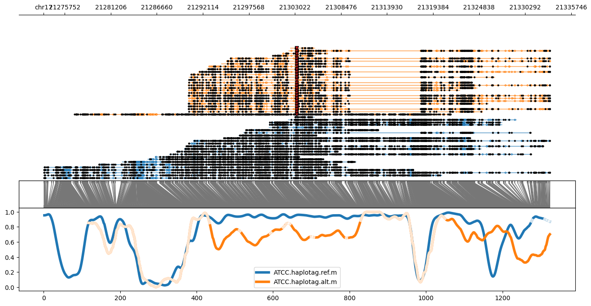
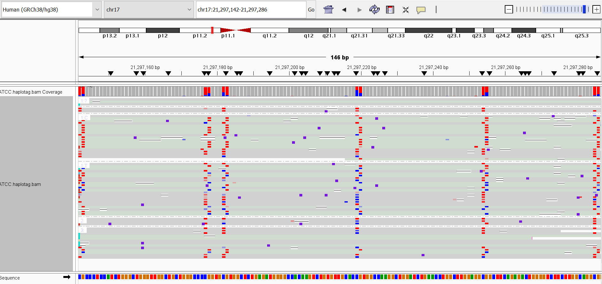
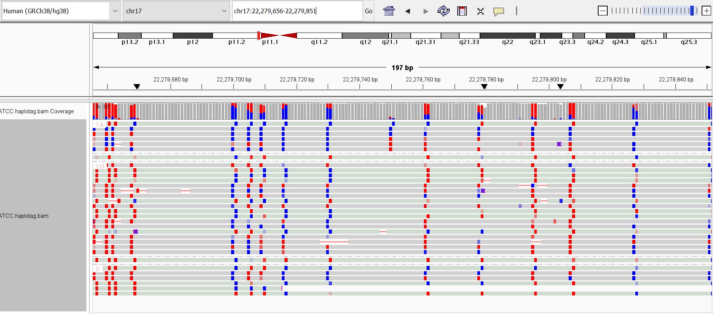
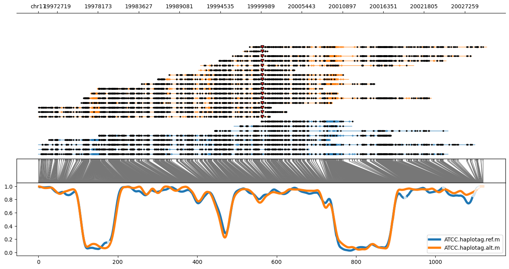
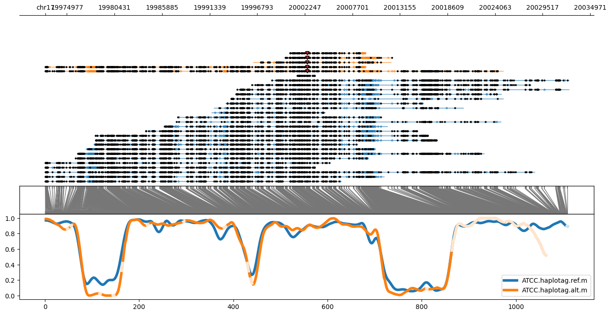
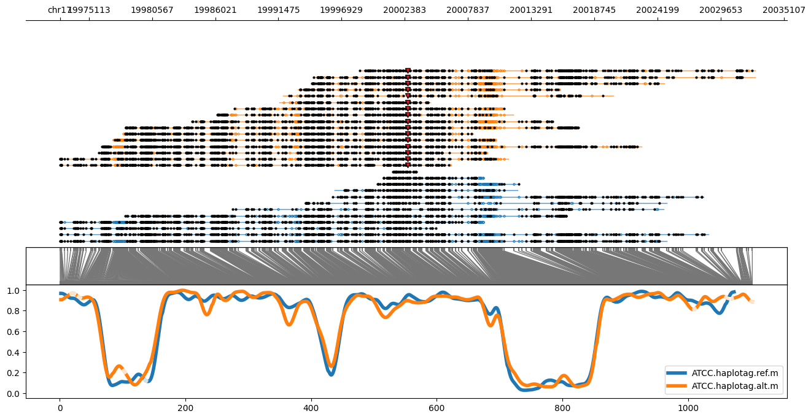

# Test data

This folder contains example datasets for testing and demonstrating the functionality of the tool using the example code provided. 

The images were created using `methylartist locus` command from the methylartist package with the variant separation feature. IGV screenshots are added to show regions
highlighted as differentially methylated in the positive predicted variant; alignments are grouped by base at variant position.

The output from this dataset predicts 2 variants to be positive and others as negative or ambiguous. There is an additional file called 
`read_parse_summary.txt` with information about which variants have 0 reads and were therefore omitted for prediction.

### Methylartist view of 2 predicted positive variants
- Variant 21303244_C_T

- Variant 22285282_A_G

### IGV view of regions from predicted positive variants
- Variant 21303244_C_T; Ref reads show higher methylation

 - Variant 22285282_A_G; Ref reads show lower methylation

### Methylartist view of a predicted negative variant

### Methylartist view of 2 predicted ambiguous variants
- Variant 20002512_A_G

- Variant 20002618_C_T

