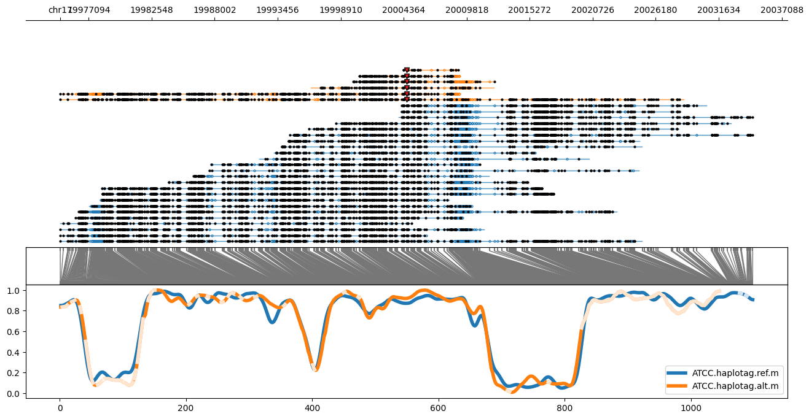

# Test data

This folder contains example datasets for testing and demonstrating the functionality of the main tool. 

The images are created using `methylartist locus` command from the methylartist package with the variant separation feature. IGV screenshots are added to show regions
highlighted as differentially methylated in the positive predicted variant; alignments are grouped by base at variant position.

The output from this dataset predicts 2 variants to be positive and others as negative or ambiguous. There is an additional file called 
`read_parse_summary.txt` with information about which variants has 0 reads and were therefore omitted for prediction.

### Methylartist view of 2 predicted positive variants

### IGV view of regions from predicted positive variants

### Methylartist view of 2 predicted negative variants

### Methylartist view of 2 predicted ambiguous variants

