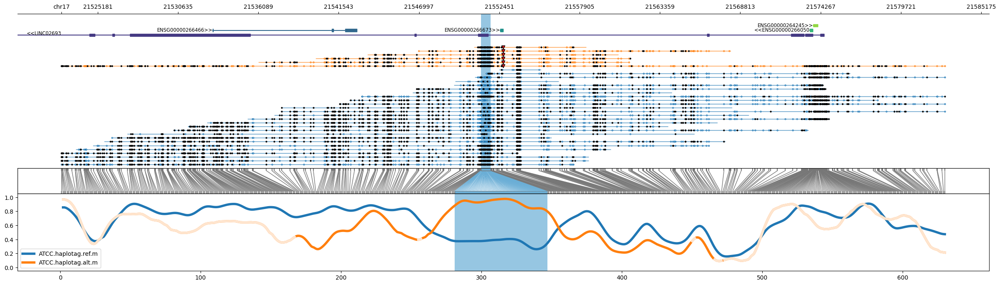
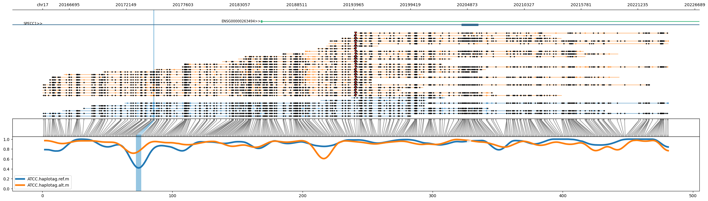
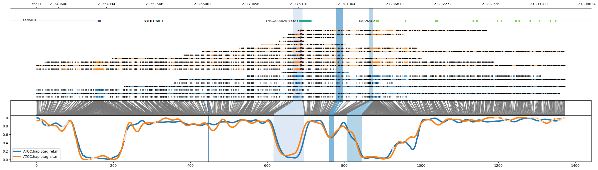

# Test data

This folder contains example datasets for testing and demonstrating the functionality of the tool using the example code provided for SNV. 

The images represent 1 example of predicted positive, negative, and ambiguous variant. They were created using `methylartist locus` 
command from the methylartist package with the variant separation feature.
The regions identified as differentially methylated are highlighted in blue; alignments are grouped by variant. The code used to
generate the images is provided in `methplot.sh` with txt file `regionsforplotting.txt`. 

The additional file called `read_parse_summary.txt` contains variants with 0 supporting reads and were therefore omitted for prediction.
`chr17atcc.vcf_output.tsv` contains the full output from unduliner.

### Methylartist view of 3 variants
- Variant 21552715_C_T (labelled positive)

- Variant 20194149_A_G (labelled negative)

- Variant 21276149_C_A (labelled ambiguous)

